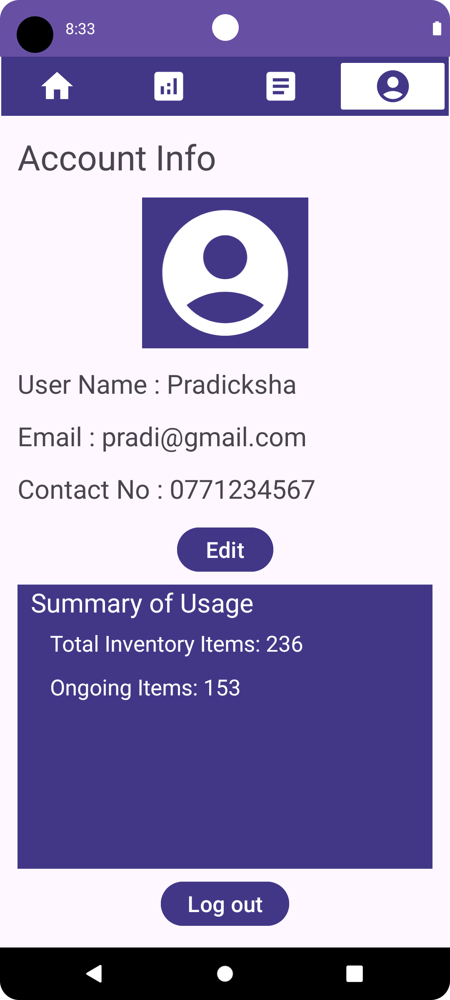

<H1>InventoMate</H1>

InventoMate is a cutting-edge inventory management application tailored for mobile devices, providing seamless stock tracking and optimization solutions for businesses across various industries. Catering to the needs of managers and inventory handlers, this app is designed to address the challenges of maintaining accurate inventory levels efficiently.

<h2>Target Audience:</h2>
InventoMate is crafted for businesses of all sizes, from small startups to large enterprises, operating in diverse sectors such as retail, manufacturing, logistics, and more. Its user-friendly interface makes it accessible to managers, warehouse supervisors, and inventory controllers who seek to streamline their inventory management processes.

<h2>Core Problem Solving:</h2>
The app tackles the common pain points associated with manual inventory tracking, such as inaccuracies, inefficiencies, and the lack of real-time insights. By offering features like real-time monitoring, automated alerts for low stock or expiration dates, and customizable reports, InventoMate empowers users to make informed decisions, reduce stockouts, minimize excess inventory, and ultimately enhance operational efficiency.

<h2>Core Features:</h2>
<ul>
<li>Real-time Monitoring: Users can track inventory levels, item movements, and stock statuses in real-time, ensuring up-to-date insights into their inventory.</li>
<li>Automated Alerts: InventoMate sends automated alerts and notifications to users when stock levels reach predefined thresholds or when items are nearing expiration, enabling proactive inventory management.</li>
<li>Customizable Reports: The app allows users to generate customizable reports based on various parameters such as sales trends, inventory turnover, and stock replenishment needs, facilitating informed decision-making.</li>
<li>User-friendly Interface: With intuitive navigation and user-friendly design, InventoMate ensures a seamless user experience, even for those with minimal technical expertise.</li>
</ul>
<h2>Color Scheme (Following the 60-30-10 Rule):</h2>
<ul>
<li>Primary Color: White (Background) </li>
<ul>
<li>Providing a clean and professional backdrop for easy readability and navigation.</li></ul>
<li>Secondary Color: Purple (Buttons and Layouts) </li>
<ul>
<li>Adding vibrancy and visual appeal while maintaining consistency across the interface.</li></ul>
<li>Accent Colors: Black and White (Letters) </li>
<ul>
<li>Ensuring optimal contrast for text readability and enhancing overall accessibility.</li></ul>
</ul>
<h2>Layouts and Views:</h2>
InventoMate utilizes a combination of linear layouts (both horizontal and vertical), constraint layouts, and scroll views to optimize screen space and ensure a responsive user interface. Views such as TextViews, EditTexts, Buttons, and ImageViews are strategically placed to enhance usability and functionality, facilitating seamless interaction with the app's features.
  

## Screenshots of app UI

  

    

 

  

    

<h2>Language : </h2>

